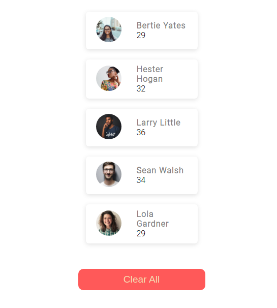

# User List in React



The default template project for [nano-react-app](https://github.com/nano-react-app/nano-react-app).

- `npm start` — This will spawn a development server with a default port of `3000`.
- `npm run build` — This will output a production build in the `dist` directory.

## Custom port

You can use the `-p` flag to specify a port for development. To do this, you can either run `npm start` with an additional flag:

```
npm start -- --port 1234
```

Or edit the `start` script directly:

```
vite --port 1234
```

## Adding styles

You can use CSS files with simple ES2015 `import` statements anywhere in your Javascript:

```js
import "./index.css";
```
# How it works
- Data is taken from premade file named data.js which acts as API response
- Adding the list data works which is based on State
- Clear all button updates the state using empty array [] which clears the lists
